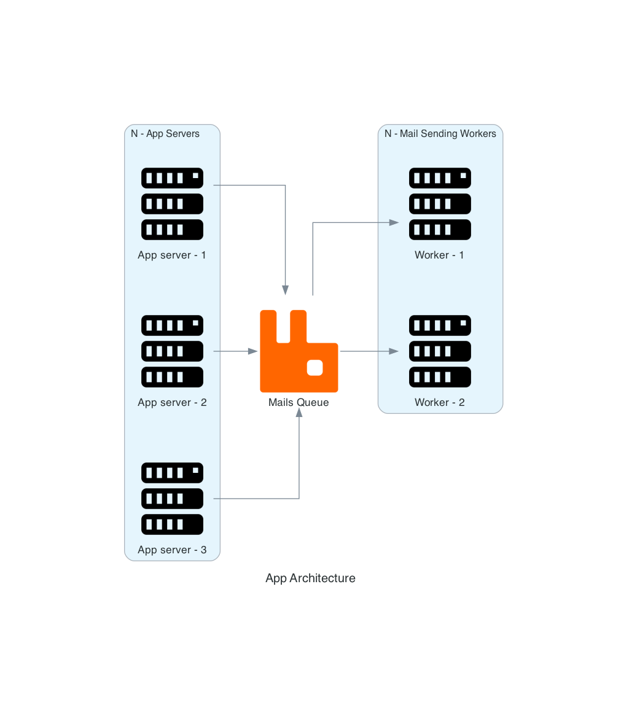

# Project Setup

Create a virtual environment

> python3 -m venv venv

Install packages

> pip3 install -r requirements.txt

Depending on the Os, install `graphviz` module.

Run following command to generate image

> python3 index.py

Output

